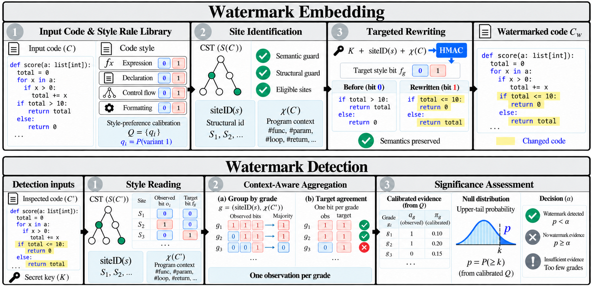

# SEW: Style-Encoded Watermarking of LLM-Generated Code

<p align="center">
  <a href="https://github.com/suhanmen/SEW/stargazers">
    
  </a>
  <a href="https://github.com/suhanmen/SEW/commits/main">
    
  </a>
  <a href="https://github.com/suhanmen/SEW/graphs/contributors">
    
  </a>
</p>

<div align="center">
    <a href="https://arxiv.org/abs/2609.39414"><b>Paper Link</b>📖</a>
</div><br>


## 📰 News

- 📢 NEW! The SEW paper is available on arXiv: [arXiv:2609.39414](https://arxiv.org/abs/2609.39414). (Sep 30, 2026)
- 📢 The official **SEW** code has been released on GitHub. (Sep 30, 2026)


## 🔍 Motivation


| Feature                    | Token-level watermarks (KGW, SWEET, Unigram, STONE, STA-1)    | Post-hoc watermarks (ACW, SrcMarker, RoSeMary)                      | ✨ SEW                                                                       |
| -------------------------- | ------------------------------------------------------------- | ------------------------------------------------------------------- | --------------------------------------------------------------------------- |
| **Access**                 | **Decoding-time** (biases token selection)                    | **Post-hoc** (rewrites finished code)                               | **Post-hoc** (rewrites finished code, model-agnostic)                       |
| **Functional correctness** | **Changes the program** (detectability–correctness trade-off) | **Can break programs** (Java/C++ pass@1 ≈ 12% for neural rewriting) | **Preserved** (pass@1 equal to unwatermarked code)                          |
| **Predictability**         | —                                                             | **Recurring patterns** (recovered from 10 watermarked programs)     | **Key- and context-dependent** (choices vary with each program's structure) |
| **Detection (TPR@FPR5%)**  | **14–60%**                                                    | **31–98%**                                                          | ⚡ **98.7–99.5%**                                                            |


Watermarking LLM-generated code supports provenance tracking. Watermarks that modify token selection during generation trade detectability against functional correctness, and they require control over the generating model. Post-hoc methods instead watermark completed code with predefined transformations or trained neural models, but their recurring patterns make the watermark predictable across programs, and patterns that are already common in unwatermarked code are counted as watermark evidence, which causes false detections. **SEW** asks: *can the code style of an already generated program carry a watermark that is correct by construction, hard to predict, and calibrated against human-written code?*

## ✨ About SEW

<p align="center">
  
</p>

**SEW** (**S**tyle-**E**ncoded **W**atermarking) embeds and detects watermarks in already generated code through three components:

1. **Code style rules with keyed, context-dependent choices.** Semantically equivalent style choices collected from style guides and transformation rules (29 for Python, 22 for Java, 19 for C++; e.g., `x += 1` / `x = x + 1`, `range(n)` / `range(0, n)`, `if (c) s;` / `if (c) { s; }`) are matched on the concrete syntax tree (CST). Which variant a site takes is decided by a secret key and the site's structural context.
2. **Style-preference calibration.** Watermark evidence is evaluated against the probability of each style variant in human-written code, so styles that people already prefer count for less.
3. **Context-aware style aggregation.** Sites at structurally matching locations that are assigned the same style choice are combined into one vote, so that repeated applications of one choice do not inflate the evidence.

Detection needs only the suspect code and the key — not the generating model, the original code, or any record of the embedding.

## 🚀 What makes SEW valuable?

✅ **Model-agnostic and correct by construction** — SEW only rewrites style sites where both variants have the same semantics, so it works on the output of any model and keeps pass@1 equal to that of the unwatermarked code.

✅ **Calibrated evidence** — A Poisson-binomial test with style probabilities estimated from human-written code (LeetCode solutions, disjoint from the evaluation data) keeps false detections on human code low.

✅ **Robust and hard to infer** — SEW keeps its detection under formatting, linting, comment removal and variable renaming, and an adversary who observes watermarked programs cannot recover its style choices the way it recovers those of the post-hoc baselines.

## 📈 Results

**Main result — detection on CodeContests** (TPR@FPR5% / AUROC, %), averaged over three LLMs (Qwen3.5-9B, gemma-4-12B-it, gpt-oss-20b).


| Type        | Method    | Python            | Java              | C++               |
| ----------- | --------- | ----------------- | ----------------- | ----------------- |
| Token-level | KGW       | 48.33 / 80.56     | 43.30 / 72.31     | 59.31 / 84.54     |
|             | SWEET     | 59.92 / 85.18     | 41.19 / 76.56     | 60.01 / 87.24     |
|             | Unigram   | 57.45 / 88.97     | 36.54 / 71.37     | 47.05 / 71.13     |
|             | STONE     | 28.09 / 62.33     | 14.38 / 62.95     | 23.65 / 64.79     |
|             | STA-1     | 35.26 / 66.26     | 20.93 / 61.48     | 44.71 / 73.72     |
| Post-hoc    | ACW       | 90.10 / 95.05     | –                 | –                 |
|             | SrcMarker | 90.21 / 97.86     | 71.52 / 93.58     | 69.88 / 81.55     |
|             | RoSeMary  | 97.86 / 97.32     | 31.00 / 95.46     | 81.26 / 89.44     |
|             | **SEW**   | **99.49 / 99.64** | **98.70 / 98.99** | **99.22 / 99.38** |


**Functional correctness** (pass@1 of the watermarked code, %; unwatermarked code: 57.63 / 52.05 / 53.74).


| Method    | Python    | Java      | C++       |
| --------- | --------- | --------- | --------- |
| ACW       | 56.00     | –         | –         |
| SrcMarker | 56.78     | 11.87     | 11.82     |
| RoSeMary  | 56.39     | 11.71     | 11.52     |
| **SEW**   | **57.63** | **52.05** | **53.74** |


**Robustness to code-editing attacks** (TPR@FPR5%, %, averaged over three LLMs and three languages; ACW: Python only).


| Method    | No attack | Formatting | Linting   | Comment removal | Renaming  |
| --------- | --------- | ---------- | --------- | --------------- | --------- |
| KGW       | 50.31     | 43.31      | 49.99     | 24.48           | 43.26     |
| SWEET     | 53.71     | 49.79      | 53.00     | 19.34           | 48.83     |
| ACW       | 90.10     | 0.51       | 93.56     | 89.35           | 3.17      |
| SrcMarker | 77.20     | 77.23      | 76.42     | 77.20           | 26.43     |
| RoSeMary  | 70.04     | 67.00      | 69.42     | 70.04           | 22.26     |
| **SEW**   | **99.14** | **95.57**  | **98.99** | **99.14**       | **99.14** |


Our experiments on CodeContests with three LLMs and three programming languages show:

- **Higher detection in every language.** SEW reaches 98.70–99.49% TPR@FPR5% on average in each language, above every token-level and post-hoc baseline.
- **No loss of functional correctness.** SEW changes only semantically equivalent style choices, so the watermarked code passes exactly the tests the original code passes.
- **Robust to code editing.** Formatting, linting, comment removal and renaming leave SEW's detection nearly unchanged, while each post-hoc baseline loses most of its signal under at least one of them.
- **Hard to infer.** After observing only 10 watermarked programs, an adversary recovers the insertion decisions of ACW (99.54–99.77%), SrcMarker (89.45–94.53%) and RoSeMary (85.70–94.79%); SEW's key- and context-dependent choices give the lowest recovery in every setting.

For the full tables, rule-aware flipping and LLM rewriting attacks, and ablations, see the paper.

## 🔬 Case Study: What each post-hoc watermark does to a program


| Method        | Embeds by                                                                                  | Example edit                                                  | What goes wrong                                                                                                                                                                                     | Same site under SEW                                                                                                                                   |
| ------------- | ------------------------------------------------------------------------------------------ | ------------------------------------------------------------- | --------------------------------------------------------------------------------------------------------------------------------------------------------------------------------------------------- | ----------------------------------------------------------------------------------------------------------------------------------------------------- |
| **ACW** | Fixed rules, always the same direction; detect = re-apply and see nothing change | `line = line + w` → `line = w + line`<br>`if n > 0` → `if 0 < n` | ❌ No type guard: `abcde` → `ecdab`<br>❌ Same pattern everywhere: 10 programs reveal it (99.7%)<br>❌ Spacing is part of the mark: `black` rewrites it, re-apply changes the code, check fails (90.1 → 0.5) | ✅ Numeric operands only: `line + w` kept<br>✅ Direction set by key + context (19.9%)<br>✅ Syntax choices survive `black` and are tested alone (99.1 → 95.6) |
| **SrcMarker** | Trained selector picks transformations + renames identifiers; trained extractor reads them | `while (n-- > 0)` → `while (--n > 0)` | ❌ One iteration fewer: Java/C++ pass@1 ≈ 12%<br>❌ Renaming drops the identifier bits (77.2 → 26.4)<br>❌ Needs the extractor model | ✅ `n--` with its value used is not a site<br>✅ Names are not evidence (99.1 → 99.1)<br>✅ Key only |
| **RoSeMary** | CodeT5 rewriter trained with an extractor; mark in learned edits + renamed identifiers | `int count` → `int cnt`<br>`i-- > 0` → `--i > 0` | ❌ Same loop breakage: pass@1 ≈ 12%<br>❌ Learned edits recur: 10 programs reveal them (86%)<br>❌ Renaming (70.0 → 22.3); needs the extractor | ✅ Identifiers never rewritten or counted<br>✅ Same rule, different target per program (19.9%)<br>✅ No model: parser + key + probability table |


| CodeContests, mean over three LLMs                | ACW                              | SrcMarker                       | RoSeMary                        | **SEW**                           |
| ------------------------------------------------- | -------------------------------- | ------------------------------- | ------------------------------- | --------------------------------- |
| pass@1 kept                                       | ❌                                | ❌                               | ❌                               | ✅                                 |
| Worst code edit, TPR@FPR5% before → after         | 📉 formatting 90.1 → 0.5 (−89.6) | 📉 renaming 77.2 → 26.4 (−50.8) | 📉 renaming 70.0 → 22.3 (−47.8) | formatting 99.1 → 95.6 (**−3.6**) |
| Rule inference from 10 programs (lower is better) | 🔓 99.7%                          | 🔓 90.2%                         | 🔓 86.0%                         | **19.9%**                         |
| Detection needs                                   | rules                            | trained extractor               | trained extractor               | **key only**                      |


## 🛠️ Setup


### Datasets

SEW is evaluated on **CodeContests** (`deepmind/code_contests` on the Hugging Face Hub), `valid` + `test` splits: 203 Python, 223 Java and 267 C++ problems that have a human solution passing the problem's tests. The human solutions serve as negatives. The style probabilities in `sew/q_table.json` were estimated from `kaysss/leetcode-problem-solutions` (Hugging Face Hub), which is disjoint from the evaluation data.

### Environment

Python 3.10. Embedding and detection need only `tree-sitter` and its Python / Java / C++ grammars. Code generation and the LLM rewriting attack need a GPU (`torch`, `transformers`); the Java lint attack needs JDK 21 and the Error Prone jars.

## ⚡ Quickstart


### **Step 1: Clone the Repository**

```shell
git clone https://github.com/suhanmen/SEW.git
cd SEW
```


### **Step 2: Set up the environment**

```shell
conda env create --file environment/environment.yaml
conda activate sew
```


### **Step 3: Watermark and detect**

```shell
python sew_cli.py embed solution.py -o solution_wm.py    # embed
python sew_cli.py detect solution_wm.py                  # detect
```

The language is inferred from the file extension (or `--lang {python,java,cpp}`); `--key <hex>` sets the secret key.

```python
from sew import embed, detect

key = bytes.fromhex("00112233445566778899aabbccddeeff")
r = embed(code, "python", key)          # {"status": "ok" | "abstain:<reason>", "code": ..., "n_edits": ...}
d = detect(r["code"], "python", key)    # {"verdict": ..., "p": ..., "p_all": ..., "p_syntax": ..., "n_grades": ...}
```


### **Step 4: Reproduce the experiments**

```shell
export HF_HUB_CACHE=/path/to/hf-cache          # models and dataset
export ERRORPRONE_DIR=/path/to/errorprone      # Java lint attack (the two jars named in attacks/edit_attacks.py)
bash scripts/run_pipeline.sh                   # data, generation, detection, attacks
ATTACKS=all,llm bash scripts/run_pipeline.sh   # also the LLM rewriting attack
```


| Step       | Script                            | Output                                     |
| ---------- | --------------------------------- | ------------------------------------------ |
| data       | `scripts/prepare_codecontests.py` | `data/codecontests/<lang>/human.jsonl`     |
| generation | `scripts/generate.py` (GPU)       | `results/generations/<lang>/<model>.jsonl` |
| detection  | `scripts/evaluate.py`             | `results/detect/<lang>__<model>.json`      |
| attacks    | `scripts/evaluate_attacks.py`     | `results/attacks/<lang>__<model>.json`     |


Other options of `run_pipeline.sh`: `STEPS`, `LANGS`, `MODELS`, `ATTACK_MODELS`, `ATTACKS`, `KEY`, `LIMIT`, `OUT`.

## 🏗️ Code Structure

```
SEW/
├── sew/
│   ├── embed.py                     # ⭐ keyed fixpoint embedding
│   ├── detect.py                    # ⭐ aggregation + calibrated dual test
│   ├── keying.py                    # HMAC-SHA256 target variant
│   ├── stats.py                     # binomial / Poisson-binomial tails
│   ├── config.py                    # significance level, minimum evidence
│   ├── q_table.json                 # style probabilities from human-written code
│   ├── sites/
│   │   ├── discovery.py             # site discovery and overlap resolution
│   │   ├── siteid.py                # structural site identifiers
│   │   ├── ctx.py                   # file context
│   │   └── typeinfo.py              # numeric type inference for Python guards
│   └── rules/
│       ├── base.py                  # rule interface, CST parsing, edits
│       ├── python_rules*.py         # 29 Python style rules
│       └── c_family_rules*.py       # 22 Java / 19 C++ style rules
├── attacks/
│   ├── edit_attacks.py              # formatting, linting, comment removal, renaming
│   ├── flip.py                      # rule-aware flipping
│   ├── llm_rewrite.py               # LLM rewriting
│   └── errorprone_checks_2.50.0.txt # Error Prone checks for the Java lint attack
├── scripts/
│   ├── prepare_codecontests.py      # CodeContests human solutions
│   ├── codecontests_selection.json  # evaluated problems and solutions
│   ├── generate.py                  # code generation with the three LLMs
│   ├── evaluate.py                  # detection metrics
│   ├── evaluate_attacks.py          # detection under attacks
│   └── run_pipeline.sh              # end-to-end runner
├── examples/
│   ├── case_study.py                # program used in the case study
│   ├── case_study_sew.py            # its SEW watermark
│   ├── case_study_acw.py            # its ACW watermark (operand reordering)
│   └── loop_condition.cpp           # loop-condition example (SrcMarker / RoSeMary failure class)
├── environment/environment.yaml     # conda environment
├── sew_cli.py                       # command-line interface
├── LICENSE
└── README.md
```


## 🔖 Citation

```bibtex
@misc{lim2026sewstyleencodedwatermarkingllmgenerated,
      title={SEW: Style-Encoded Watermarking of LLM-Generated Code},
      author={Soohan Lim and Hyundong Jin and Yo-Sub Han},
      year={2026},
      eprint={2609.39414},
      archivePrefix={arXiv},
      primaryClass={cs.CR},
      url={https://arxiv.org/abs/2609.39414},
}
```


## 📄 License

This project is released under the [MIT License](LICENSE).